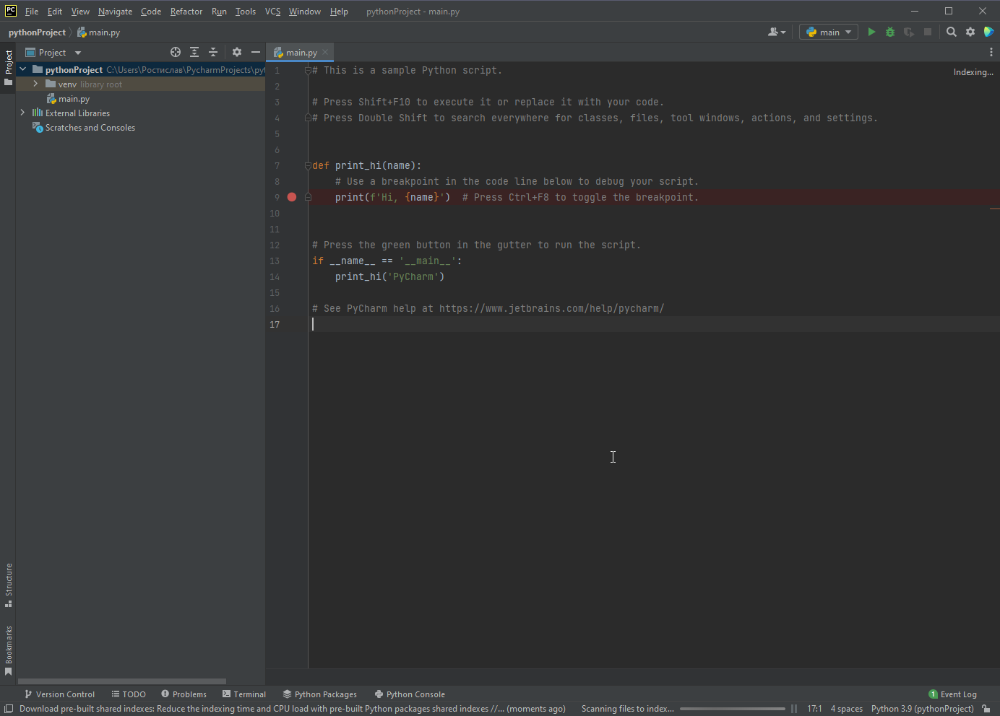
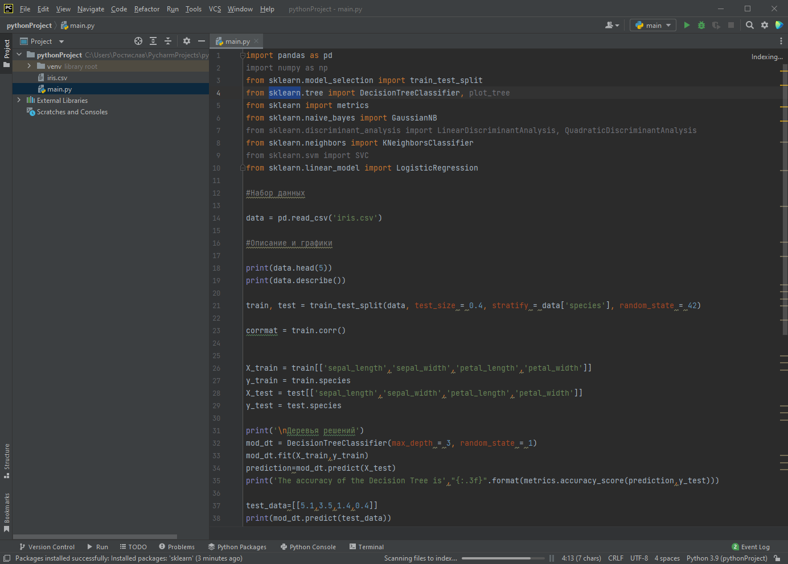
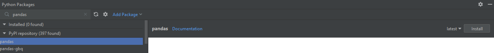
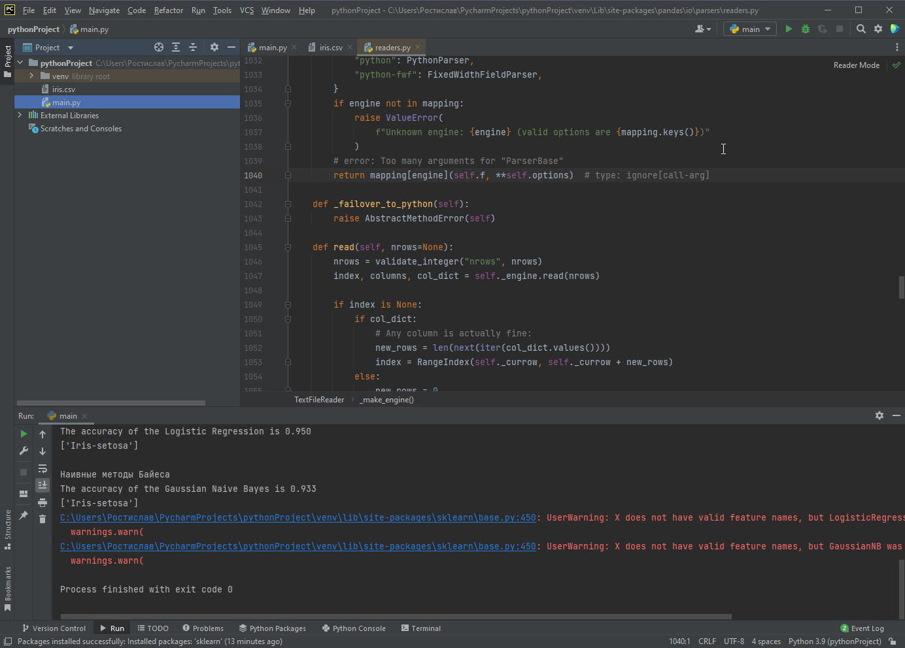

# Проектное задание
## Настройка среды + запуск кода
1) Скачиваем PyCharm и устанавливаем ([ссылка на файл](https://www.jetbrains.com/pycharm/download/download-thanks.html?platform=windows&code=PCC))

2) Создание проекта 
Нажимаем на New Project. В новом окне нажимаем на Create. 

созданный проект

3) Копируем сюда код  и переносим iris.csv

4) Надо скачать зависимости, нужно нажать на кнопку Python Packages (кнопочка внизу) 
     и в поиске вбить ```pandas numpy sklearn``` по очереди  нажать на install.

5) После того как зависимости установятся программу можно запустить по зеленому треугольнику (как кнопка play) в правом верхнем углу экрана 

6) Результат работы программы будет в нижнем окошке 

## Код программы 
Это код из примера: 
```python 
import pandas as pd
import numpy as np
from sklearn.model_selection import train_test_split
from sklearn.tree import DecisionTreeClassifier, plot_tree
from sklearn import metrics
from sklearn.naive_bayes import GaussianNB
from sklearn.discriminant_analysis import LinearDiscriminantAnalysis, QuadraticDiscriminantAnalysis
from sklearn.neighbors import KNeighborsClassifier
from sklearn.svm import SVC
from sklearn.linear_model import LogisticRegression

#Набор данных

data = pd.read_csv('iris.csv')

#Описание и графики

print(data.head(5))
print(data.describe())


train, test = train_test_split(data, test_size = 0.4, stratify = data['species'], random_state = 42)

corrmat = train.corr()


X_train = train[['sepal_length','sepal_width','petal_length','petal_width']]
y_train = train.species
X_test = test[['sepal_length','sepal_width','petal_length','petal_width']]
y_test = test.species

mod_dt = DecisionTreeClassifier(max_depth = 3, random_state = 1)
mod_dt.fit(X_train,y_train)
prediction=mod_dt.predict(X_test)
print('The accuracy of the Decision Tree is',"{:.3f}".format(metrics.accuracy_score(prediction,y_test)))

test_data=[[5.1,3.5,1.4,0.4]]
print(mod_dt.predict(test_data))


```

Основные изменения в этой строке
```python
mod_dt = DecisionTreeClassifier(max_depth = 3, random_state = 1)
``` 

---
Алгоритм K-ближайших соседей
```python
mod_knn = KNeighborsClassifier(n_neighbors=7)
```
Вопрос почему ты прировнял n_neighbors к 7? В статье ты прочитал что обычно используется значение 5, решил попробовать увеличить и на 7 точность увеличилась и ты решил его оставить.

---
Логистическая регрессия
```python
mod_lg = LogisticRegression(max_iter=120)
```

---
Наивные методы Байеса
```python
mod_gnb = GaussianNB()
```

---

Вот так это выглядит в коде который я тебе прислал

```python
print('\nДеревья решений')
mod_dt = DecisionTreeClassifier(max_depth = 3, random_state = 1)
mod_dt.fit(X_train,y_train)
prediction=mod_dt.predict(X_test)
print('The accuracy of the Decision Tree is',"{:.3f}".format(metrics.accuracy_score(prediction,y_test)))

test_data=[[5.1,3.5,1.4,0.4]]
print(mod_dt.predict(test_data))

print('\nАлгоритм K-ближайших соседей')
mod_knn = KNeighborsClassifier(n_neighbors=7)
mod_knn.fit(X_train,y_train)
prediction=mod_knn.predict(X_test)
print('The accuracy of the KNeighbors is',"{:.3f}".format(metrics.accuracy_score(prediction,y_test)))
print(mod_knn.predict(test_data))

print('\nЛогистическая регрессия')
mod_lg = LogisticRegression(max_iter=120)
mod_lg.fit(X_train,y_train)
prediction=mod_lg.predict(X_test)
print('The accuracy of the Logistic Regression is',"{:.3f}".format(metrics.accuracy_score(prediction,y_test)))
print(mod_lg.predict(test_data))

print('\nНаивные методы Байеса')
mod_gnb = GaussianNB()
mod_gnb.fit(X_train,y_train)
prediction=mod_gnb.predict(X_test)
print('The accuracy of the Gaussian Naive Bayes is',"{:.3f}".format(metrics.accuracy_score(prediction,y_test)))
print(mod_gnb.predict(test_data))
```
\n в print-ах с названиями алгоритмов это перевод на новую строку для более красивого вывода. Еще обрати внимание на 'mod_dt' в деревьях решений, в остальных алгоритмах я менял названия этой переменной (вдруг спросят).
